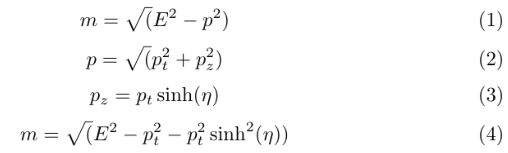
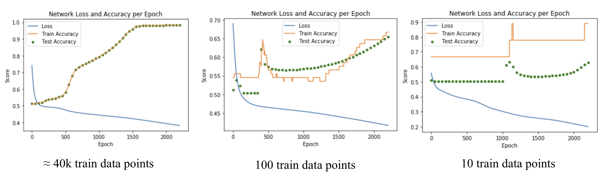

# Lepton Identification Using Neural Nets

## Introduction

This a project that aims to identify lepton flavor (electron or muon) from a sample of leptons produced in ttbar events. The neural nets used for identication are trained using only lepton kinematic information.

Unless otherwise noted, the instructions for installing packages and applications assume you are running a Unix environment. When this section of the README was last updated (02/01/2019), I was running MacOS 10.13.6, Python 3.6.5, and pip 18.1

## Development Environment

I run this in a virtual environment on my machine to keep my research python environment separate from all other python development. This ensures that I can mess up one environment without ruining the other (yes, I speak from experience).

### Setting up a Virtual Environment

Instructions to be added shortly.

### Installing and Running Jupyter Notebook
I have Jupyter Notebook installed locally on my machine, but as long as you open jupyter from inside your virtual environment, the notebook will run on your virtual kernel. 

You can find instructions for [installing jupyter](https://jupyter.org/install) here.

For Mac Users:  
To run jupyter in your virtual environment, run `/anaconda3/bin/jupyter_mac.command; exit;` from the same directory where you initialized your virtual environment.

For Everyone Else: 
¯\\\_(ツ)_/¯

### Installing the Necessary Packages

I used pip to install the necessary packages. To install the packages needed for this folder, run `pip install numpy sklearn matplotlib scipy uproot pandas` in your terminal window.

### Using the Notebooks

My notebooks often include global lists which I use to keep track of how the weights, biases, and accuracies change throughout the algorithm training. I know this is clunky, but as long as you researt the kernel every time you train the algorithm, this isn't a problem.

## Notes on My Process

### Preprocessing the Data
The dataset in small_v2.root has five factors: transverse momentum (Pt), Eta, Phi, Energy (E), and labels (isMuon). In [DataExtraction.py](DataExtraction.py), I manipulated the data from the root file to make a few separate datasets all containting the same data but in different representations. 

#### Relationships Between Input Factors in small_v2.root
In order to preprocess the data, I used the following relationships between the input factors to create new datasets.

I used these factors to calculate the mass of each lepton to distinguish between the electrons and muons and establish a baseline accuracy for my network.

#### P2 -E2

### Exploring Overtraining
In order to see if my network was overtraining I first started testing my accuracy on a testing dataset at every fiftieth epoch during training. I then plotted the train accuracy and test accuracy on the same plot to see if they diverged. The though process behind this is that if the network was overtraining, the train accuracy would end up substantially higher than the test accuracy. Once I did this and found that the test accuracy tightly correlated with the train accuracy, I trained the network on smaller subsets of the training data to see what the results of the same anlalysis would be. The expectation is that when training on a smaller dataset, the test accuracy would be much more inconsistent with the train accuracy.

